# Wino UI & Feature Walkthrough Guide

This guide provides a comprehensive visual and operational overview of all 24 panels in **Wino**. Every screenshot is rendered directly from native application builds to demonstrate real-world behavior, layout architecture, and telemetry data.

The sidebar groups the panels into five sections (Overview, Manage, Tune, Optimize, System) so 24 entries stay scannable rather than becoming one long list.

Screenshots for the panels that changed or were added in v2.6 are captured by the documented script on an interactive desktop session. Panels without an embedded image below are described in full but their capture is pending; the script produces `15_network_center.png`, `10_health_center.png`, and `17_` through `24_`.

---

## Table of Contents

1. [Dashboard & System Overview](#1-dashboard--system-overview)
2. [Memory Engine & Telemetry](#2-memory-engine--telemetry)
3. [Process Manager](#3-process-manager)
4. [Windows Debloater & Optimizer](#4-windows-debloater--optimizer)
5. [Startup Applications](#5-startup-applications)
6. [Windows Services Manager](#6-windows-services-manager)
7. [Privacy & Telemetry Center](#7-privacy--telemetry-center)
8. [Storage Cleaner](#8-storage-cleaner)
9. [Context Menu Cleaner](#9-context-menu-cleaner)
10. [Network Center](#10-network-center)
11. [Scheduled Tasks Debloater](#11-scheduled-tasks-debloater)
12. [Gaming Optimization Profile](#12-gaming-optimization-profile)
13. [Windows Health & Diagnostics](#13-windows-health--diagnostics)
14. [Restore Points & Snapshots](#14-restore-points--snapshots)
15. [Audit Logs](#15-audit-logs)
16. [Settings & Preferences](#16-settings--preferences)
17. [Application Manager](#17-application-manager)
18. [Profile Engine](#18-profile-engine)
19. [Power Manager](#19-power-manager)
20. [Windows Features](#20-windows-features)
21. [Security Center](#21-security-center)
22. [Storage Analyzer](#22-storage-analyzer)
23. [Recommendations](#23-recommendations)
24. [Before / After Benchmark](#24-before--after-benchmark)

---

## 1. Dashboard & System Overview

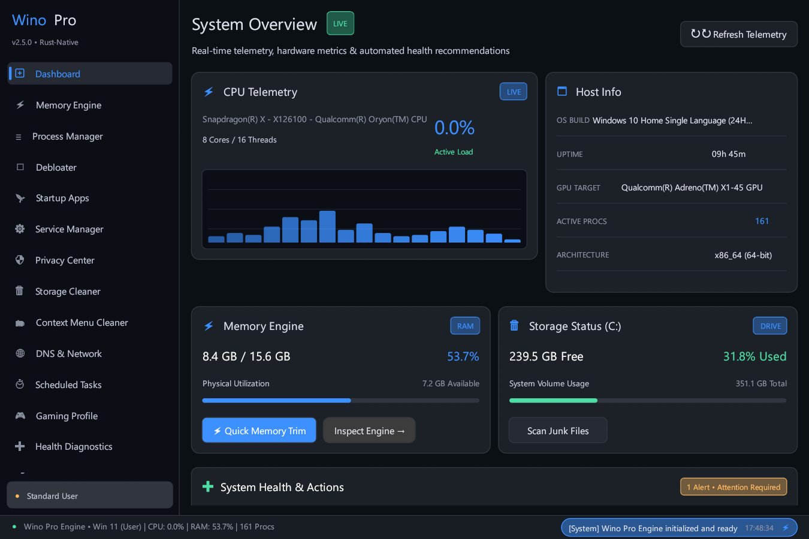

### Purpose & Architecture
The **Dashboard** serves as the central command center for real-time hardware telemetry, overall health scoring, and rapid system actions.

### Key Capabilities
- **Live CPU Histogram**: Displays instantaneous CPU utilization with a 60-sample rolling sparkline and active thread load.
- **Host Information**: Reports Windows OS version, kernel build number, system uptime, active GPU target, running process count, and processor architecture.
- **Quick Memory & Storage Cards**: View physical RAM consumption and primary drive (C:) capacity with one-click **Quick Memory Trim** and **Scan Junk Files** triggers.
- **System Health Status Banner**: Evaluates antivirus real-time protection, firewall status, and update readiness to present clear, actionable recommendations.
- **Global Status Footer**: Displays execution privileges (`Admin • Elevated` vs `Standard User`), real-time CPU/RAM metrics, and an interactive event ticker linking directly to audit logs.

---

## 2. Memory Engine & Telemetry

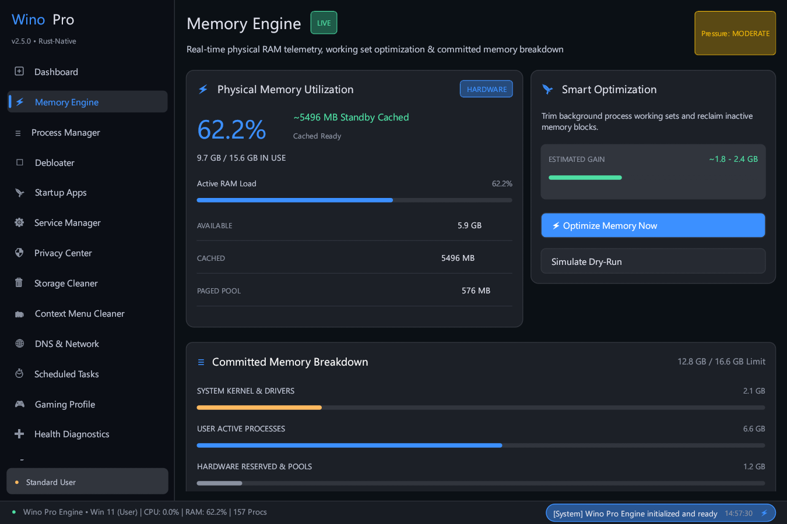

### Purpose & Architecture
The **Memory Engine** provides deep introspection into physical RAM utilization, kernel memory pools, and standby cache, paired with safe, zero-placebo working set optimization.

### Key Capabilities
- **Multi-Metric Pressure Monitor**: Evaluates RAM pressure using physical allocation, commit charge ratio, and available memory headroom (`Low`, `Moderate`, `High`, `Critical`).
- **Physical Memory Breakdown**: Inspect Available RAM, Standby Cached Memory, and Paged/Non-Paged Kernel Pools.
- **Smart Working Set Optimization**: Safely trims inactive memory blocks across background processes using native `EmptyWorkingSet` without freezing active foreground applications.
- **Dry-Run Simulation**: Estimate recoverable RAM before applying any memory trim.
- **Auto Memory Trimmer**: Configure background threshold-based trimming with configurable cooldown periods to maintain system responsiveness during heavy multitasking.

---

## 3. Process Manager

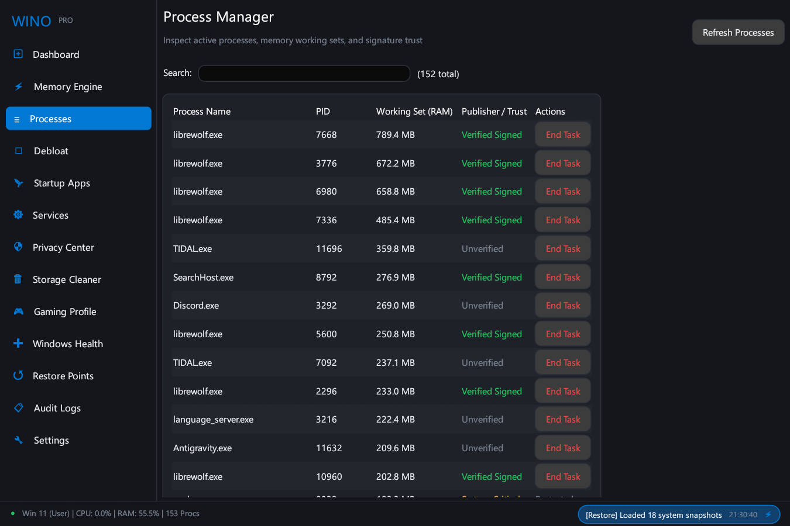

### Purpose & Architecture
The **Process Manager** delivers a high-density, precise tabular view of active Windows processes, memory footprints, and cryptographic Authenticode trust.

### Key Capabilities
- **Precision Tabular Layout**: Fixed-width, clipped column boundaries preventing text collision across any display scaling or window dimension.
- **Security Trust Badges**: Automatically categorizes processes into `Critical System` (kernel protected), `Signed Trust` (verified digital signature), or `User App` (standard executable).
- **Working Set RAM Telemetry**: Highlights per-process memory consumption in real time.
- **Instant Task Termination**: Safely terminate unresponsive user processes while strictly preventing termination of critical Windows kernel processes (`csrss.exe`, `lsass.exe`, `services.exe`, `smss.exe`).
- **Real-Time Filtering**: Instant search filtering by process executable name or numerical PID.

---

## 4. Windows Debloater & Optimizer

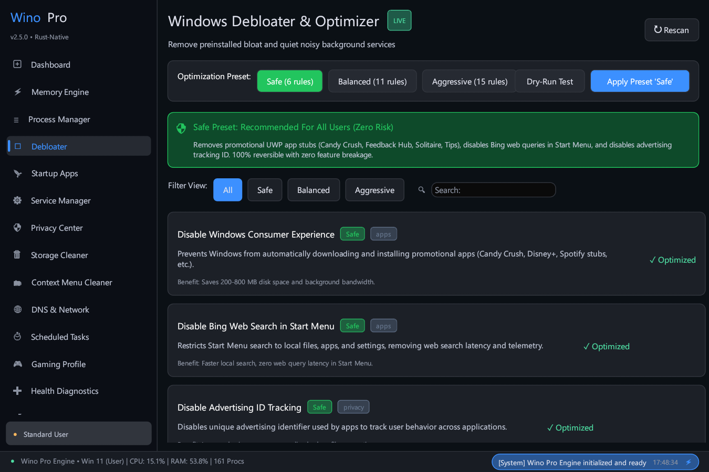

### Purpose & Architecture
The **Windows Debloater** removes preinstalled bloatware, disables intrusive promotional features, and silences non-essential background telemetry through verified, declarative rule sets.

### Key Capabilities
- **Tiered Optimization Presets**:
  - **🛡 Safe Preset (Zero Risk)**: Removes promotional UWP apps (Candy Crush, Solitaire, Tips), disables Bing Start Menu queries, and turns off advertising tracking IDs. 100% reversible with zero feature breakage.
  - **⚡ Balanced Preset**: Builds upon Safe by disabling Windows 11 Widgets news feed (saving ~200 MB RAM), Copilot side panel, Edge startup boost, and idle Xbox background services.
  - **⚠️ Aggressive Preset**: Deep debloat removing OEM promotional stubs (TikTok, Spotify, Disney) and disabling background location tracking, timeline sync, and feedback surveys.
- **Pre-Flight Safety Gating**: Interactive confirmation modal explaining exact system implications before applying Balanced or Aggressive presets.
- **Dry-Run Preview**: Inspect the exact list of registry keys, AppX packages, and service changes before execution.
- **Automated VSS Snapshots**: Automatically creates a rollback point before applying batch changes.

---

## 5. Startup Applications

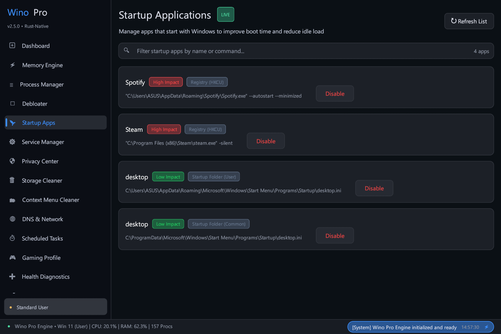

### Purpose & Architecture
The **Startup Applications** manager scans and controls software configured to launch automatically on Windows boot, reducing startup latency and background resource drain.

### Key Capabilities
- **Comprehensive Hive Scanning**: Scans `HKCU\Software\Microsoft\Windows\CurrentVersion\Run`, `HKLM\Software\...`, and user/system Startup directories.
- **Boot Impact Scoring**: Classifies applications into `High`, `Medium`, and `Low` boot impact based on binary location, startup delay, and resource usage.
- **Authenticode Signature Verification**: Verifies publisher trust certificates to highlight unsigned or suspicious startup binaries.
- **Safe Disabling**: Disables auto-launch without uninstalling or deleting user software.

---

## 6. Windows Services Manager

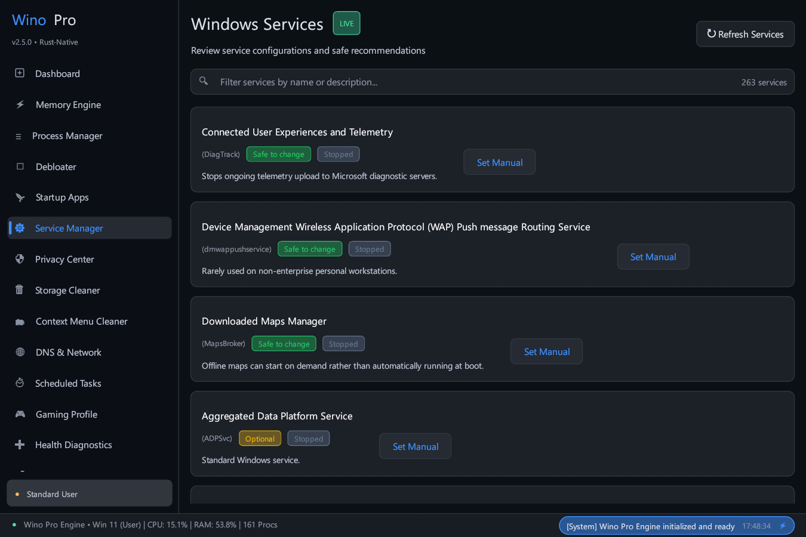

### Purpose & Architecture
The **Windows Services Manager** provides safe configuration over background Windows services using direct Service Control Manager (`OpenSCManagerW`) APIs.

### Key Capabilities
- **Safety Classifications**:
  - `Safe to change`: Diagnostic and telemetry services that can be safely switched to Manual startup (e.g. `DiagTrack`, `dmwappushservice`).
  - `Usually safe`: Optional consumer services (e.g. `XblAuthManager`, `RetailDemo`).
  - `Optional`: Feature-specific services dependent on user workflow (e.g. `Fax`, `Spooler`).
  - `Do not touch`: Critical kernel and security services (`RpcSs`, `WinDefend`, `wuauserv`) strictly blocked from modification.
- **Non-Destructive State Management**: Switches target services to `Manual` (On-Demand) rather than permanently disabling them, ensuring features remain functional if explicitly invoked by Windows.

---

## 7. Privacy & Telemetry Center

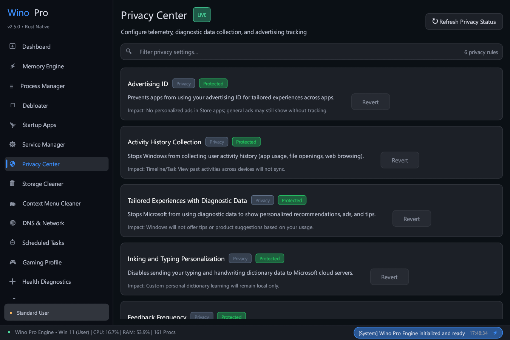

### Purpose & Architecture
The **Privacy Center** centralizes control over Windows telemetry, diagnostic data collection, advertising identifiers, and behavioral trackers.

### Key Capabilities
- **Advertising & Tracking ID**: Disable global advertising IDs used for personalized targeting across apps.
- **Diagnostic Telemetry Level**: Restrict Windows diagnostic data reporting to Security/Basic levels.
- **Activity History & Cloud Sync**: Prevent Windows from collecting app history and syncing timeline activity to cloud servers.
- **Inking & Typing Personalization**: Disable keystroke and handwriting sample collection for linguistic telemetry.
- **Location & Sensor Access**: Manage system-wide location sensor access for background desktop applications.

---

## 8. Storage Cleaner

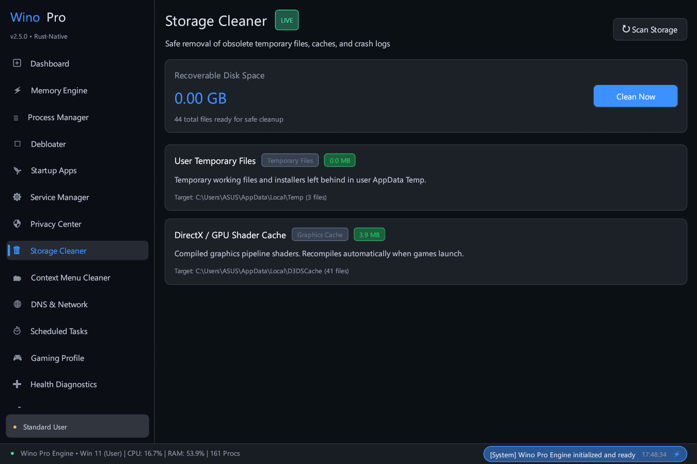

### Purpose & Architecture
The **Storage Cleaner** identifies and purges obsolete temporary files, shader caches, crash dumps, and update buffers without endangering active applications or personal documents.

### Key Capabilities
- **Multi-Location Target Scanning**: Scans `%TEMP%`, `C:\Windows\Temp`, Windows Delivery Optimization caches, DirectX/Vulkan shader caches, browser temporary stores, and system crash dumps.
- **Minimum-Age Safety Heuristics**: Automatically protects files modified within the last 24 hours to prevent conflicts with active installers or running processes.
- **Granular Category Breakdown**: Displays recoverable file counts and precise megabyte/gigabyte statistics per category.

---

## 9. Context Menu Cleaner

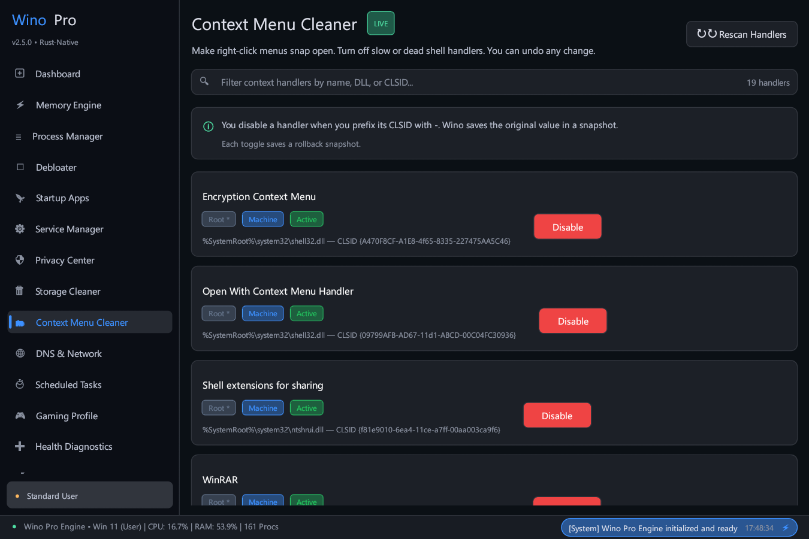

### Purpose & Architecture
The **Context Menu Cleaner** diagnoses and manages third-party shell extension handlers registered in Windows Explorer right-click menus, eliminating explorer lag and freezing.

### Key Capabilities
- **Comprehensive Hive Scanning**: Inspects `HKCR\Directory\shellex\ContextMenuHandlers` and `HKCR\Folder\shellex\ContextMenuHandlers` across machine and user scopes.
- **Non-Destructive CLSID Disabling**: Disables handlers by prefixing CLSID keys with `-`, preserving original configuration for 1-click re-enablement.
- **Automatic Rollback Snapshots**: Creates point-in-time rollback records before applying modifications.

---

## 10. Network Center

### Purpose & Architecture
The **Network Center** reports adapter state and runs connectivity diagnostics, all through native APIs. Adapter enumeration uses `GetAdaptersAddresses`; ICMP echo uses `IcmpSendEcho`; DHCP renewal uses `IpRenewAddress` and `IpReleaseAddress`; the resolver cache flush uses `DnsFlushResolverCache`. No `ping.exe`, no `ipconfig.exe`, no shell.

### Key Capabilities
- **Active Adapter Card**: Friendly name, description, link state, DHCP state, IPv4 and IPv6 addresses with prefix lengths, default gateways, DNS servers, and MAC address.
- **Diagnostic Tools**: Flush DNS, renew DHCP, release DHCP, test gateway, ping host, DNS lookup, connectivity test, latency test, and packet loss.
- **Worker-Dispatched Probes**: Every diagnostic runs on a worker thread. An ICMP sweep with retries takes seconds; running it on the UI thread would stall the frame loop, which is what the previous version did for the DNS flush.
- **DNS Presets, Labelled as Presets**: Cloudflare, Google, Quad9, and AdGuard are offered as convenience lists. The panel states plainly that they are not ranked, because which resolver is fastest depends on the network.
- **Automatic DHCP Restoration**: Selecting "Automatic" removes the static override so the DHCP-assigned resolver takes over again.

---

## 11. Scheduled Tasks Debloater

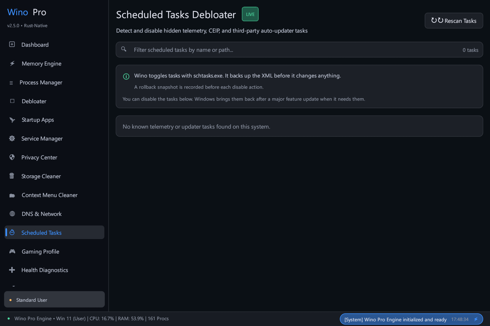

### Purpose & Architecture
The **Scheduled Tasks Debloater** scans the Windows Task Scheduler tree for known background telemetry collectors, CEIP tasks, and intrusive third-party auto-updaters.

### Key Capabilities
- **Telemetry Task Detection**: Identifies diagnostic data upload tasks (e.g. CEIP, Customer Feedback, App Compatibility Telemetry).
- **Automated XML Definition Backups**: Backs up original task definitions before applying changes.
- **Granular Enable / Disable**: Toggle task states cleanly with instant rollback snapshot tracking.

---

## 12. Gaming Optimization Profile

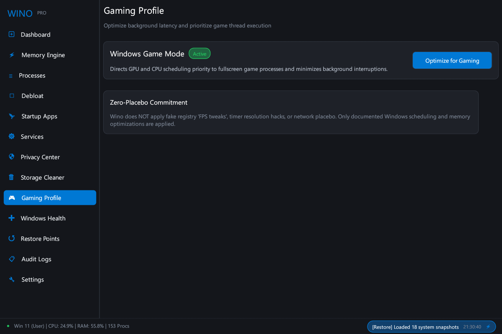

### Purpose & Architecture
The **Gaming Profile** optimizes Windows thread scheduling, GPU priority, and power policies for maximum frame pacing and minimum input latency.

### Key Capabilities
- **Windows Game Mode Activation**: Configures native Windows Game Mode to prioritize CPU and GPU scheduling for fullscreen games.
- **Background Latency Reduction**: Minimizes background process interruptions and network bandwidth contention during active gaming sessions.
- **Zero-Placebo Commitment**: Avoids harmful timer resolution hacks, bogus network registry tweaks, and broken system service modifications.

---

## 13. System Health Center

### Purpose & Architecture
The **System Health Center** reports the live state of the checks that matter for Windows stability, and runs the official repair tools on demand. Every check reports what it actually observed; a check that cannot be queried reports `Unknown`, never a fabricated pass.

### Key Capabilities
- **Per-Check Verdicts**: Windows Update, Microsoft Defender, Windows Firewall, Base Filtering Engine, RPC, pending reboot, system drive space, component store, and system file integrity, each with `Healthy`, `Attention`, `Warning`, `Critical`, or `Unknown`.
- **Windows Update Is a Real Query**: The service state is read from the Service Control Manager. The previous version reported it as healthy without checking.
- **Problems First**: Non-healthy checks are lifted above the full list, ordered by severity, so a stopped core service does not require scrolling.
- **Unknowns Are Counted and Named**: When checks could not be queried, the count is shown next to the overall rating, because a report that says "Healthy" while two checks were unreadable would be the exact failure this center exists to prevent.
- **SFC and DISM on Workers**: Run SFC, DISM CheckHealth, and DISM ScanHealth from the panel. Output is captured, shown in the view, and written to the audit log. These tools take minutes, so they never run on the UI thread.
- **Elevation Disclosed Up Front**: When administrator privileges are required and absent, the panel says so before the user presses a button.

---

## 14. Restore Points & Snapshots

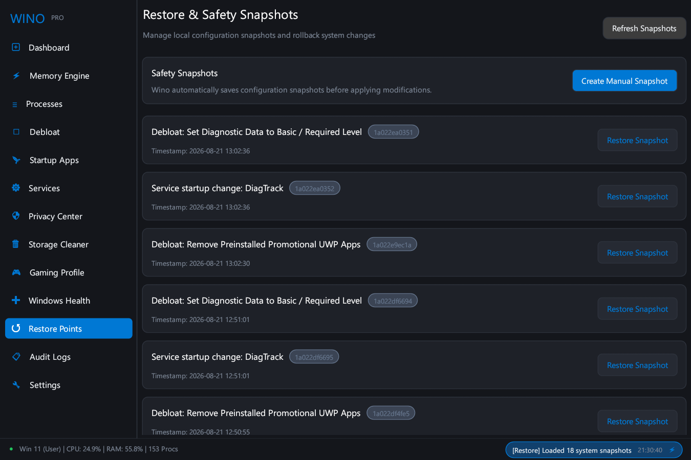

### Purpose & Architecture
The **Restore Points & Snapshots** engine provides complete state tracking and point-in-time configuration recovery across all optimization actions.

### Key Capabilities
- **JSON Configuration Snapshots**: Timestamped records storing prior registry values, service configurations, context menu handlers, and scheduled task states.
- **One-Click Granular Rollback**: Restore any past snapshot to revert settings to their exact prior state.
- **Native Windows System Restore (VSS)**: Create full Windows Volume Shadow Copy restore points for kernel-level recovery.

---

## 15. Audit Logs

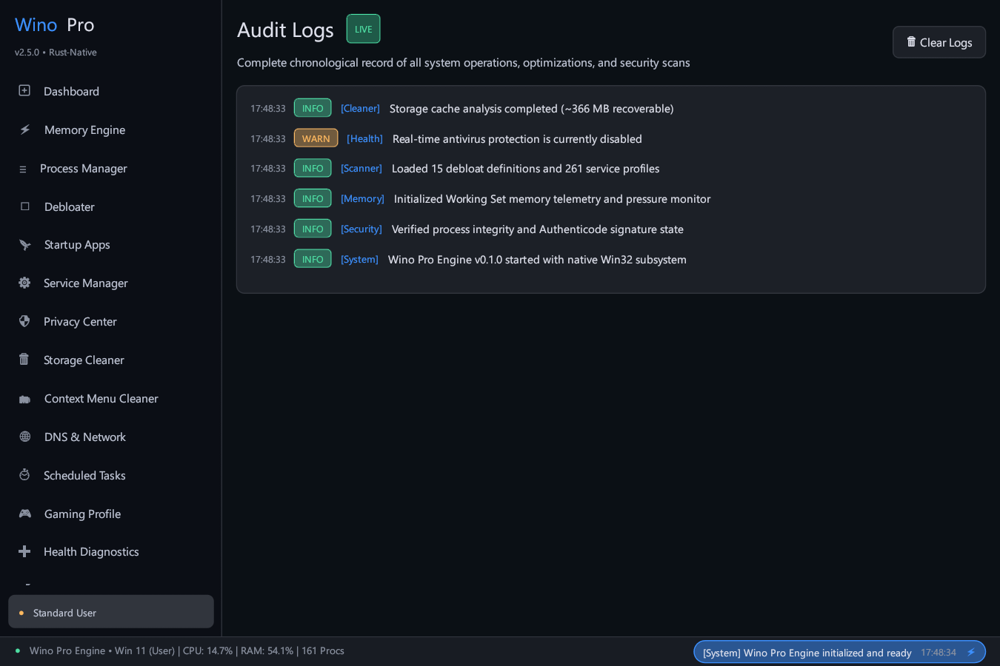

### Purpose & Architecture
The **Audit Logs** view presents an immutable, chronological record of all system modifications, scans, and optimization events performed during the session.

### Key Capabilities
- **Timestamped Operations**: Track execution times down to the millisecond with source target and severity level badges (`INFO`, `WARN`, `ERROR`).
- **Dry-Run Audit Trail**: Verify simulated changes and pre-flight validations before applying system changes.
- **One-Click Log Reset**: Easily purge in-memory log history when finished.

---

## 16. Settings & Preferences

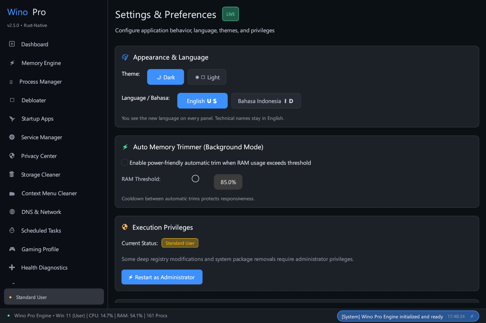

### Purpose & Architecture
The **Settings** panel manages application appearance, bilingual localization, execution privileges, and background automated memory trimming behavior.

### Key Capabilities
- **Theme Selection**: Switch between **Dark Mode** (OLED-friendly dark palette) and **Light Mode** (Crisp high-contrast theme).
- **Dual-Language Localization**: Toggle seamlessly between **English** and **Bahasa Indonesia** with instant UI refresh.
- **Privilege Elevation**: Inspect current security token (`Admin • Elevated` vs `Standard User`) and trigger UAC restart when administrator privileges are required.
- **Auto Memory Trimmer Configuration**: Enable automated memory trimming with adjustable RAM threshold percentage and cooldown intervals.

## 17. Application Manager

### Purpose & Architecture
The **Application Manager** presents one list across four package sources, because a user looking for "what is installed" does not care which subsystem installed it. Records come from the classic `Uninstall` registry keys, the Microsoft Store / AppX package store, provisioned AppX packages, and Winget.

### Key Capabilities
- **Unified Discovery**: Win32 installed programs, Microsoft Store packages, provisioned AppX packages, and Winget-known packages in a single searchable list.
- **Full Record Per Application**: Display name, publisher, version, install location, install size, install date, package type, source, signature state, and uninstall availability.
- **Search, Filter, Sort**: Free-text search across name, publisher, and path; source filter chips (All / Win32 / Microsoft Store / AppX / Winget); sort by name, publisher, size, install date, or version.
- **Honest Uninstall Availability**: An application with no removal path shows **"Uninstall unavailable"** instead of a button that cannot work. The record knows its own removal method: a quiet uninstall command, an MSI product code, a plain uninstall command, or an AppX package.
- **Winget as an Optional Provider**: The update section reports available updates with a state badge (Update Available, Latest, Unknown). When Winget is absent the panel says so and explains that only update checks need it; the rest of Wino is unaffected.
- **Confirmed Removal**: Uninstall runs the application's own uninstaller after a confirmation that states it is irreversible and that a snapshot is taken first.

---

## 18. Profile Engine

### Purpose & Architecture
The **Profile Engine** composes existing Wino operations into named, reviewable bundles. A profile step names an operation that already exists (a debloat rule, a service change, a power plan), so applying a profile routes through the same Safety Engine, snapshots, and audit log as applying that operation by hand. A profile can never bypass the engine.

### Key Capabilities
- **Six Built-In Profiles**: Balanced, Gaming, Performance, Battery Saver, Privacy, and Low RAM. Each states what it does and, explicitly, what it does not do.
- **Custom Profiles**: Duplicate a built-in to customise it, or import one from TOML. Built-ins cannot be deleted; the panel says why and points at Duplicate.
- **Step Grouping**: Steps are grouped by kind (Registry, Service, Power, Scheduled Task, Memory, Visual Effects, Privacy, Startup) so a long profile stays readable.
- **Safety Preview**: The Preview action renders the exact `OperationDescriptor` set the Safety Engine validates: risk badge, reversibility, administrator requirement, restart requirement, and current and target state.
- **Disclosed Blocked Steps**: Steps the Safety Engine will hard-block are named on the card before Apply is pressed, so the user confirms what will actually run.
- **Honest Results**: A profile application reports applied, failed, and skipped counts separately. A partial application is reported as partial.

---

## 19. Power Manager

### Purpose & Architecture
The **Power Manager** reports the active power plan and exposes the advanced settings a user can safely change. Plans are addressed by GUID, because that is how the Windows power API identifies them; names come from Windows itself so a localized install shows its own wording.

### Key Capabilities
- **Active Plan Card**: The active scheme's name, its category, and its GUID.
- **Plan Switching**: Balanced, High Performance, Power Saver, Ultimate Performance, plus any custom scheme present on the machine. Switching is confirmed and snapshotted.
- **Ultimate Performance, Honestly Handled**: The scheme does not exist on a stock install. The panel says so and offers a button that *creates* it, with the copy making clear that activating it is a separate step.
- **Advanced Settings with AC and DC**: Processor minimum and maximum state, processor boost behavior, sleep and display timeouts, USB selective suspend, PCI Express link state, and disk idle timeout.
- **No Control for Unexposed Settings**: A setting the active scheme does not expose renders explanatory text and no control at all. A slider bound to an unreadable value would display and write back a fabricated number.
- **Verified Writes**: Each write records the previous AC/DC values in a snapshot, applies the change, and re-reads it. A write that did not take effect returns an error rather than reporting success.

---

## 20. Windows Features

### Purpose & Architecture
The **Windows Features** panel lists optional Windows components with their state and dependencies. State is read and changed through `dism.exe`, the documented interface for optional components; the crate exposes no DISM API surface.

### Key Capabilities
- **State and Dependencies**: `Enabled`, `Disabled`, `Requires Reboot`, or `Unknown`, plus the dependency list.
- **Curated Risk and Impact**: Components that materially change system behavior carry an explicit warning that is rendered inline, not hidden behind a tooltip: Hyper-V, Virtual Machine Platform, Windows Sandbox, OpenSSH Server, IIS, Telnet, PowerShell 2.0, and others.
- **Dependency Disclosure**: Dependencies that DISM would enable implicitly are named before you confirm, so Windows does not add them silently.
- **No Dead Buttons**: A feature in a state Wino cannot toggle renders as text, never as a disabled button. "Unknown" is a result, not a failure.
- **High-Risk Features Are Marked**: OpenSSH Server and IIS are rated High risk because they install services and open network listeners.

---

## 21. Security Center

### Purpose & Architecture
The **Security Center** reports protection state across Microsoft Defender, Windows Firewall, Secure Boot, TPM, UAC, SmartScreen, Windows Update, and critical security services. It reports state and nothing else.

### Key Capabilities
- **Protection Status Per Component**: Each component shows its state (`On`, `Off`, `Warning`, `Unknown`) with the detail behind the verdict.
- **Warnings Are Prominent**: A disabled protection is lifted to the top of the panel and tagged as disabled outside Wino. It is the one thing on this page the user must not have to scroll to find.
- **Unknown Is a Real Result**: A component that could not be queried is listed as `Unknown`, not silently omitted and not assumed healthy.
- **No Disable Path**: Wino exposes no mechanism to turn a security protection off as an optimization. The panel states this unconditionally, because the absence of a toggle is only reassuring when it is stated.
- **TPM Version**: When a TPM is present, its specification version is shown alongside the state.

---

## 22. Storage Analyzer

### Purpose & Architecture
The **Storage Analyzer** answers where the space on the system drive went. It is read-only by construction: nothing in this panel deletes a file. Reclaiming space still goes through the Storage Cleaner and its safety workflow.

### Key Capabilities
- **Usage by Category**: Applications, Windows, Users, ProgramData, Temp, and Other, each with its measured size and share.
- **Directory Breakdown**: The largest directories with their recursive size, file count, and share of the parent. Directories are classified by whole path component, so `C:\WindowsApps` is not mistaken for `C:\Windows`.
- **Large and Old Files**: Files above the configured size threshold and files above the configured age threshold, each with size and age. A file whose timestamp cannot be read is never reported as old.
- **Cache Locations**: The paths the Storage Cleaner targets, measured, with a pointer to the Cleaner rather than a delete button.
- **Partial Scans Say So**: A scan that hit the entry limit, was cancelled, or skipped inaccessible paths and reparse points discloses all of it. The analyzer never follows a reparse point, so a junction loop cannot trap the walk.
- **Cancellable**: A long scan can be stopped from the panel and reports the partial results it gathered.

---

## 23. Recommendations

### Purpose & Architecture
The **Recommendations** panel reports measured observations about this machine across RAM, commit charge, startup impact, optional services, reclaimable temporary data, power plan, privacy state, security state, update state, disk space, and pending packages.

### Key Capabilities
- **Every Card Carries Its Number**: Each recommendation shows the measured value it is based on. A recommendation without its number is indistinguishable from a guess.
- **Severity and Area Badges**: High, Medium, Low, or Info, plus the subsystem the observation concerns.
- **Review, Never Apply**: Every card has a Review action that opens the view where the change would be made. There is no apply button here at all, and the panel states that plainly.
- **Absence of Evidence Is Not a Problem**: An unqueryable check produces no recommendation. A machine with nothing to report shows an explicit "nothing needs attention" state, which is a valid result rather than a failed scan.

---

## 24. Before / After Benchmark

### Purpose & Architecture
The **Before / After Benchmark** captures measured system state and compares two captures. It reports measured deltas only: there is no estimated-performance field anywhere, because any such number would be derived rather than measured.

### Key Capabilities
- **Captured Metrics**: Idle RAM used, process count, startup entry count, temporary data size, active power plan, selected service states, and selected privacy states.
- **Explicit Selection**: Two captures are selected for comparison rather than comparing the newest two automatically, so a comparison is always between states the user chose.
- **Measured Deltas**: Each row shows the before value, the after value, and the change, coloured by direction. Service and privacy state changes are listed individually.
- **Read-Only Capture**: Taking a capture changes nothing. A "before" capture taken mid-experiment does not perturb the machine.

---

## Capturing Documentation Screenshots

To re-capture all UI screenshots synchronously across every tab after visual updates:

```powershell
powershell -ExecutionPolicy Bypass -File scripts\capture.ps1
```

This compiles the standalone `capture_screenshots` binary, pre-loads realistic system state, steps through all 24 navigation tabs, captures pixel-perfect native frames, and converts them to optimized PNG files in `docs/screenshots/`.

---

*Wino — Built with Rust for Windows 10 & 11. Transparent, Safe, and Reversible.*
