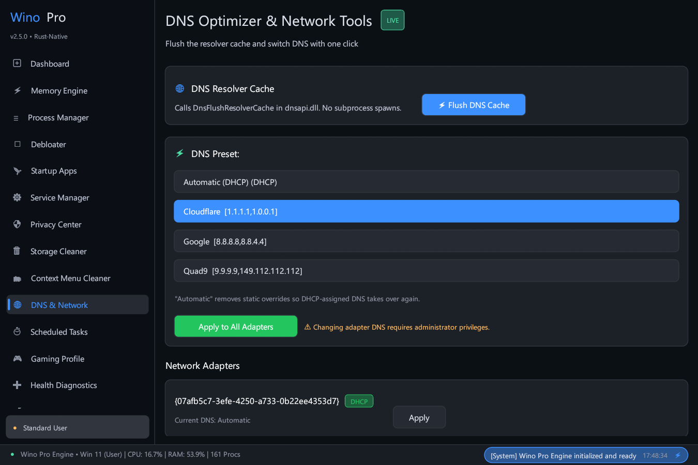
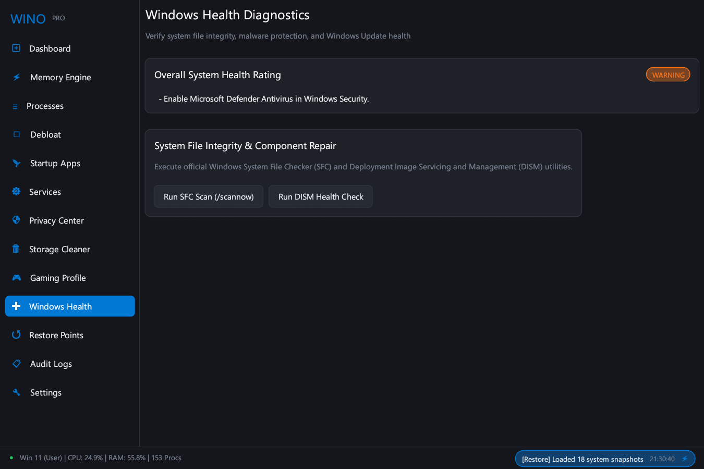

# Wino UI & Feature Walkthrough Guide

This guide provides a comprehensive visual and operational overview of all 16 panels in **Wino**. Every screenshot is rendered directly from native application builds to demonstrate real-world behavior, layout architecture, and telemetry data.

---

## Table of Contents

1. [Dashboard & System Overview](#1-dashboard--system-overview)
2. [Memory Engine & Telemetry](#2-memory-engine--telemetry)
3. [Process Manager](#3-process-manager)
4. [Windows Debloater & Optimizer](#4-windows-debloater--optimizer)
5. [Startup Applications](#5-startup-applications)
6. [Windows Services Manager](#6-windows-services-manager)
7. [Privacy & Telemetry Center](#7-privacy--telemetry-center)
8. [Storage Cleaner](#8-storage-cleaner)
9. [Context Menu Cleaner](#9-context-menu-cleaner)
10. [DNS & Network Tools](#10-dns--network-tools)
11. [Scheduled Tasks Debloater](#11-scheduled-tasks-debloater)
12. [Gaming Optimization Profile](#12-gaming-optimization-profile)
13. [Windows Health & Diagnostics](#13-windows-health--diagnostics)
14. [Restore Points & Snapshots](#14-restore-points--snapshots)
15. [Audit Logs](#15-audit-logs)
16. [Settings & Preferences](#16-settings--preferences)

---

## 1. Dashboard & System Overview


### Purpose & Architecture
The **Dashboard** serves as the central command center for real-time hardware telemetry, overall health scoring, and rapid system actions.

### Key Capabilities
- **Live CPU Histogram**: Displays instantaneous CPU utilization with a 60-sample rolling sparkline and active thread load.
- **Host Information**: Reports Windows OS version, kernel build number, system uptime, active GPU target, running process count, and processor architecture.
- **Quick Memory & Storage Cards**: View physical RAM consumption and primary drive (C:) capacity with one-click **Quick Memory Trim** and **Scan Junk Files** triggers.
- **System Health Status Banner**: Evaluates antivirus real-time protection, firewall status, and update readiness to present clear, actionable recommendations.
- **Global Status Footer**: Displays execution privileges (`Admin • Elevated` vs `Standard User`), real-time CPU/RAM metrics, and an interactive event ticker linking directly to audit logs.

---

## 2. Memory Engine & Telemetry


### Purpose & Architecture
The **Memory Engine** provides deep introspection into physical RAM utilization, kernel memory pools, and standby cache, paired with safe, zero-placebo working set optimization.

### Key Capabilities
- **Multi-Metric Pressure Monitor**: Evaluates RAM pressure using physical allocation, commit charge ratio, and available memory headroom (`Low`, `Moderate`, `High`, `Critical`).
- **Physical Memory Breakdown**: Inspect Available RAM, Standby Cached Memory, and Paged/Non-Paged Kernel Pools.
- **Smart Working Set Optimization**: Safely trims inactive memory blocks across background processes using native `EmptyWorkingSet` without freezing active foreground applications.
- **Dry-Run Simulation**: Estimate recoverable RAM before applying any memory trim.
- **Auto Memory Trimmer**: Configure background threshold-based trimming with configurable cooldown periods to maintain system responsiveness during heavy multitasking.

---

## 3. Process Manager


### Purpose & Architecture
The **Process Manager** delivers a high-density, precise tabular view of active Windows processes, memory footprints, and cryptographic Authenticode trust.

### Key Capabilities
- **Precision Tabular Layout**: Fixed-width, clipped column boundaries preventing text collision across any display scaling or window dimension.
- **Security Trust Badges**: Automatically categorizes processes into `Critical System` (kernel protected), `Signed Trust` (verified digital signature), or `User App` (standard executable).
- **Working Set RAM Telemetry**: Highlights per-process memory consumption in real time.
- **Instant Task Termination**: Safely terminate unresponsive user processes while strictly preventing termination of critical Windows kernel processes (`csrss.exe`, `lsass.exe`, `services.exe`, `smss.exe`).
- **Real-Time Filtering**: Instant search filtering by process executable name or numerical PID.

---

## 4. Windows Debloater & Optimizer


### Purpose & Architecture
The **Windows Debloater** removes preinstalled bloatware, disables intrusive promotional features, and silences non-essential background telemetry through verified, declarative rule sets.

### Key Capabilities
- **Tiered Optimization Presets**:
  - **🛡 Safe Preset (Zero Risk)**: Removes promotional UWP apps (Candy Crush, Solitaire, Tips), disables Bing Start Menu queries, and turns off advertising tracking IDs. 100% reversible with zero feature breakage.
  - **⚡ Balanced Preset**: Builds upon Safe by disabling Windows 11 Widgets news feed (saving ~200 MB RAM), Copilot side panel, Edge startup boost, and idle Xbox background services.
  - **⚠️ Aggressive Preset**: Deep debloat removing OEM promotional stubs (TikTok, Spotify, Disney) and disabling background location tracking, timeline sync, and feedback surveys.
- **Pre-Flight Safety Gating**: Interactive confirmation modal explaining exact system implications before applying Balanced or Aggressive presets.
- **Dry-Run Preview**: Inspect the exact list of registry keys, AppX packages, and service changes before execution.
- **Automated VSS Snapshots**: Automatically creates a rollback point before applying batch changes.

---

## 5. Startup Applications


### Purpose & Architecture
The **Startup Applications** manager scans and controls software configured to launch automatically on Windows boot, reducing startup latency and background resource drain.

### Key Capabilities
- **Comprehensive Hive Scanning**: Scans `HKCU\Software\Microsoft\Windows\CurrentVersion\Run`, `HKLM\Software\...`, and user/system Startup directories.
- **Boot Impact Scoring**: Classifies applications into `High`, `Medium`, and `Low` boot impact based on binary location, startup delay, and resource usage.
- **Authenticode Signature Verification**: Verifies publisher trust certificates to highlight unsigned or suspicious startup binaries.
- **Safe Disabling**: Disables auto-launch without uninstalling or deleting user software.

---

## 6. Windows Services Manager


### Purpose & Architecture
The **Windows Services Manager** provides safe configuration over background Windows services using direct Service Control Manager (`OpenSCManagerW`) APIs.

### Key Capabilities
- **Safety Classifications**:
  - `Safe to change`: Diagnostic and telemetry services that can be safely switched to Manual startup (e.g. `DiagTrack`, `dmwappushservice`).
  - `Usually safe`: Optional consumer services (e.g. `XblAuthManager`, `RetailDemo`).
  - `Optional`: Feature-specific services dependent on user workflow (e.g. `Fax`, `Spooler`).
  - `Do not touch`: Critical kernel and security services (`RpcSs`, `WinDefend`, `wuauserv`) strictly blocked from modification.
- **Non-Destructive State Management**: Switches target services to `Manual` (On-Demand) rather than permanently disabling them, ensuring features remain functional if explicitly invoked by Windows.

---

## 7. Privacy & Telemetry Center


### Purpose & Architecture
The **Privacy Center** centralizes control over Windows telemetry, diagnostic data collection, advertising identifiers, and behavioral trackers.

### Key Capabilities
- **Advertising & Tracking ID**: Disable global advertising IDs used for personalized targeting across apps.
- **Diagnostic Telemetry Level**: Restrict Windows diagnostic data reporting to Security/Basic levels.
- **Activity History & Cloud Sync**: Prevent Windows from collecting app history and syncing timeline activity to cloud servers.
- **Inking & Typing Personalization**: Disable keystroke and handwriting sample collection for linguistic telemetry.
- **Location & Sensor Access**: Manage system-wide location sensor access for background desktop applications.

---

## 8. Storage Cleaner


### Purpose & Architecture
The **Storage Cleaner** identifies and purges obsolete temporary files, shader caches, crash dumps, and update buffers without endangering active applications or personal documents.

### Key Capabilities
- **Multi-Location Target Scanning**: Scans `%TEMP%`, `C:\Windows\Temp`, Windows Delivery Optimization caches, DirectX/Vulkan shader caches, browser temporary stores, and system crash dumps.
- **Minimum-Age Safety Heuristics**: Automatically protects files modified within the last 24 hours to prevent conflicts with active installers or running processes.
- **Granular Category Breakdown**: Displays recoverable file counts and precise megabyte/gigabyte statistics per category.

---

## 9. Context Menu Cleaner


### Purpose & Architecture
The **Context Menu Cleaner** diagnoses and manages third-party shell extension handlers registered in Windows Explorer right-click menus, eliminating explorer lag and freezing.

### Key Capabilities
- **Comprehensive Hive Scanning**: Inspects `HKCR\Directory\shellex\ContextMenuHandlers` and `HKCR\Folder\shellex\ContextMenuHandlers` across machine and user scopes.
- **Non-Destructive CLSID Disabling**: Disables handlers by prefixing CLSID keys with `-`, preserving original configuration for 1-click re-enablement.
- **Automatic Rollback Snapshots**: Creates point-in-time rollback records before applying modifications.

---

## 10. DNS & Network Tools



### Purpose & Architecture
The **DNS & Network** panel provides rapid network troubleshooting utilities and secure DNS configuration switching for improved privacy, security, and response times.

### Key Capabilities
- **Native DNS Cache Flush**: Calls `DnsFlushResolverCache` directly in `dnsapi.dll` for instant resolver cache purging without console popups.
- **Verified DNS Presets**:
  - **Cloudflare DNS**: `1.1.1.1` / `1.0.0.1` (Ultra-low latency, strict privacy)
  - **Google Public DNS**: `8.8.8.8` / `8.8.4.4` (High reliability, global Anycast routing)
  - **Quad9**: `9.9.9.9` / `149.112.112.112` (Malware blocking, DNSSEC validation)
  - **AdGuard DNS**: `94.140.14.14` / `94.140.15.15` (Default ad & tracker blocking)
- **Automatic DHCP Restoration**: Easily revert adapter DNS configuration to automatic DHCP mode.

---

## 11. Scheduled Tasks Debloater


### Purpose & Architecture
The **Scheduled Tasks Debloater** scans the Windows Task Scheduler tree for known background telemetry collectors, CEIP tasks, and intrusive third-party auto-updaters.

### Key Capabilities
- **Telemetry Task Detection**: Identifies diagnostic data upload tasks (e.g. CEIP, Customer Feedback, App Compatibility Telemetry).
- **Automated XML Definition Backups**: Backs up original task definitions before applying changes.
- **Granular Enable / Disable**: Toggle task states cleanly with instant rollback snapshot tracking.

---

## 12. Gaming Optimization Profile


### Purpose & Architecture
The **Gaming Profile** optimizes Windows thread scheduling, GPU priority, and power policies for maximum frame pacing and minimum input latency.

### Key Capabilities
- **Windows Game Mode Activation**: Configures native Windows Game Mode to prioritize CPU and GPU scheduling for fullscreen games.
- **Background Latency Reduction**: Minimizes background process interruptions and network bandwidth contention during active gaming sessions.
- **Zero-Placebo Commitment**: Avoids harmful timer resolution hacks, bogus network registry tweaks, and broken system service modifications.

---

## 13. Windows Health & Diagnostics



### Purpose & Architecture
The **Windows Health** panel centralizes official Windows system file integrity verification and component store repair tools.

### Key Capabilities
- **System File Checker (SFC)**: Execute asynchronous `sfc /scannow` runs to identify and repair corrupted system files.
- **DISM Component Store Repair**: Launch `DISM /Online /Cleanup-Image /RestoreHealth` for deep Windows component servicing.
- **Antivirus & Firewall Diagnostics**: Monitor Windows Defender real-time protection, definition age, and firewall filter status.

---

## 14. Restore Points & Snapshots


### Purpose & Architecture
The **Restore Points & Snapshots** engine provides complete state tracking and point-in-time configuration recovery across all optimization actions.

### Key Capabilities
- **JSON Configuration Snapshots**: Timestamped records storing prior registry values, service configurations, context menu handlers, and scheduled task states.
- **One-Click Granular Rollback**: Restore any past snapshot to revert settings to their exact prior state.
- **Native Windows System Restore (VSS)**: Create full Windows Volume Shadow Copy restore points for kernel-level recovery.

---

## 15. Audit Logs


### Purpose & Architecture
The **Audit Logs** view presents an immutable, chronological record of all system modifications, scans, and optimization events performed during the session.

### Key Capabilities
- **Timestamped Operations**: Track execution times down to the millisecond with source target and severity level badges (`INFO`, `WARN`, `ERROR`).
- **Dry-Run Audit Trail**: Verify simulated changes and pre-flight validations before applying system changes.
- **One-Click Log Reset**: Easily purge in-memory log history when finished.

---

## 16. Settings & Preferences


### Purpose & Architecture
The **Settings** panel manages application appearance, bilingual localization, execution privileges, and background automated memory trimming behavior.

### Key Capabilities
- **Theme Selection**: Switch between **Dark Mode** (OLED-friendly dark palette) and **Light Mode** (Crisp high-contrast theme).
- **Dual-Language Localization**: Toggle seamlessly between **English** and **Bahasa Indonesia** with instant UI refresh.
- **Privilege Elevation**: Inspect current security token (`Admin • Elevated` vs `Standard User`) and trigger UAC restart when administrator privileges are required.
- **Auto Memory Trimmer Configuration**: Enable automated memory trimming with adjustable RAM threshold percentage and cooldown intervals.

---

## Capturing Documentation Screenshots

To re-capture all UI screenshots synchronously across every tab after visual updates:

```powershell
powershell -ExecutionPolicy Bypass -File scripts\capture.ps1
```

This compiles the standalone `capture_screenshots` binary, pre-loads realistic system state, steps through all 16 navigation tabs, captures pixel-perfect native frames, and converts them to optimized PNG files in `docs/screenshots/`.

---

*Wino — Built with Rust for Windows 10 & 11. Transparent, Safe, and Reversible.*
